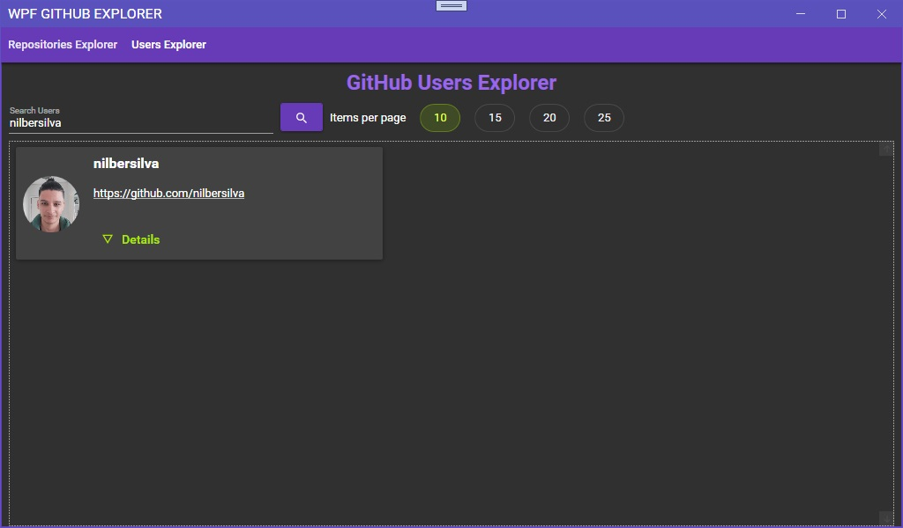

# WPFGitHubExplorer

## About
WPF .NET Core 5.0 - Search GitHub Repositories

## Technologies

The following tools were used in this project:

- [Windows Presentation Foundation - WPF](https://docs.microsoft.com/en-us/visualstudio/designers/getting-started-with-wpf?view=vs-2019)
- [.NET Core 5.0](https://dotnet.microsoft.com/download/dotnet/5.0)
- [MaterialDesignInXamlToolkit](https://github.com/MaterialDesignInXAML/MaterialDesignInXamlToolkit)
- [MahApps](https://mahapps.com)
- [Dragablz](https://dragablz.net)

## Screenshots

<div align="center"> 
  <h3>Search Repositories</h3>
  
</div>
<div align="center"> 
  <h3>Search Users</h3>
  
</div>
<div align="center"> 
  <h3>User Detail</h3>
  
</div>

## Requirements

- [Visual Studio](https://visualstudio.microsoft.com)
- [.NET Core 5.0](https://dotnet.microsoft.com/download/dotnet/5.0)

## Starting

```bash
# Clone this project
$ git clone https://github.com/nilbersilva/WPFGitHubExplorer

# Access folder
$ cd WPFGitHubExplorer/WPFGitHubExplorer

# Build
$ dotnet build

# Run the project
$ dotnet run
```

## License

This project is under license from MIT. For more details, see the [LICENSE](https://github.com/nilbersilva/WPFGitHubExplorer/blob/main/LICENSE) file.

<a href="#top">Back to top</a>
